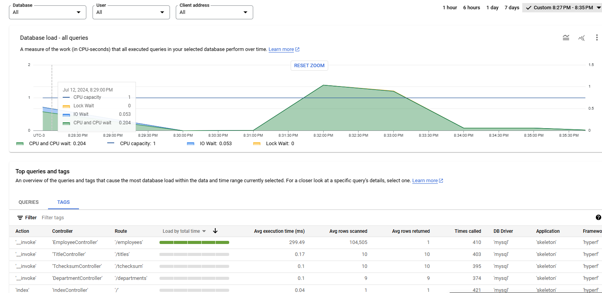
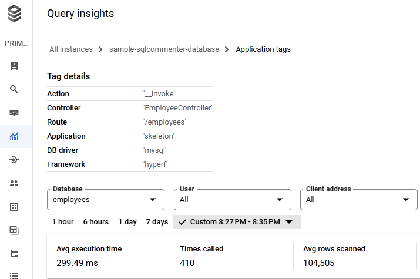
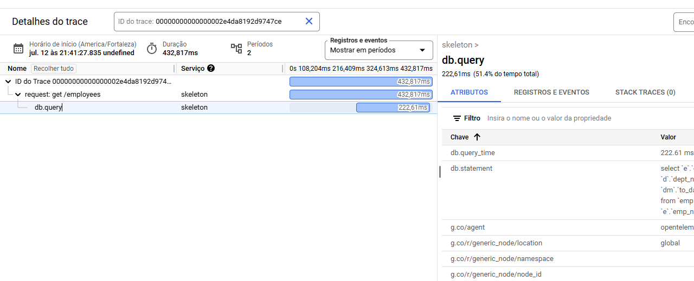
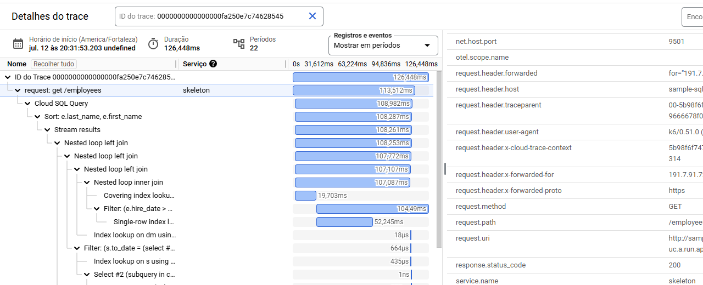
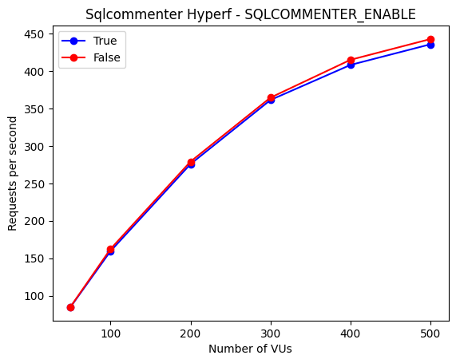

English | [Português](./README-PT.md)

<p align="center"><a href="https://google.github.io/sqlcommenter/" target="_blank" rel="noopener noreferrer"></a></p>

<p align="center">
  <a href="https://github.com/reinanhs/sqlcommenter-hyperf/releases"></a>
  <a href="https://www.php.net"></a>
  <a href="https://packagist.org/packages/reinanhs/sqlcommenter-hyperf"></a>
  <a href="https://github.com/reinanhs/sqlcommenter-hyperf/blob/main/LICENSE"></a>
</p>

## Introduction

Sqlcommenter Hyperf is a library designed to automatically add comments to SQL queries executed by
the [Hyperf](https://github.com/hyperf/hyperf) framework. These comments use
the [sqlcommenter](https://google.github.io/sqlcommenter/) format, which is understood by various database tools and
services, providing enhanced insights and traceability for your application's database interactions.

## Installation

You can install the library via Composer:

```shell
composer require reinanhs/sqlcommenter-hyperf
```

Add component configuration:

```shell
php bin/hyperf.php vendor:publish reinanhs/sqlcommenter-hyperf
```

## Sample

See an example of a simple query being executed:

```sql
select *
from users
```

Using this package, comments like this will be added:

```sql
select *
from users /*framework='Hyperf',
application='hyperf-skeleton',
controller='UserController',
action='index',
route='%%2Fapi%%2Ftest',
db_driver='mysql',
traceparent='00-1cd60708968a61e942b5dacc2d4a5473-7534abe7ed36ce35-01'*/
```

By examining the above SQL statement and its comment in `/*...*/`, we can correlate and identify the fields in the slow
SQL query to our source code in our web application:

> Table 1: Information about the description of each type of comment

| ORIGINAL FIELD                                                            | INTERPRETATION                                                                                                               |
|---------------------------------------------------------------------------|------------------------------------------------------------------------------------------------------------------------------|
| **framework**='Hyperf'                                                    | The word “Hyperf” represents the framework that generated the query.                                                         |
| **application**='hyperf-skeleton'                                         | The name of the project where the code was run.                                                                              |
| **controller**='UserController'                                           | Controller name in `app/Controller`.                                                                                         |
| **action**='index'                                                        | Name of the method that was called called by the controller.                                                                 |
| **route**='%%2Fapi%%2Ftest'                                               | The route used during the query call.                                                                                        |
| **db_driver**='mysql'                                                     | The name of the Hyperf database engine.                                                                                      |
| **traceparent**='00-1cd60708968a61e942b5dacc2d4a5473-7534abe7ed36ce35-01' | The [W3C TraceContext Traceparent](https://www.w3.org/TR/trace-context/#traceparent-field) field of the OpenTelemetry trace. |

Various tools and services can interpret these comments, helping to correlate user code with SQL statements generated by
the ORM, and can be examined in the database server logs. This provides better observability into your application state
up to the database server.

Here is an example of how this information appears
within [Google Cloud SQL](https://cloud.google.com/sql/docs/postgres/using-query-insights):



The image above illustrates how sqlcommenter information is mapped within Google Cloud. In this context, sqlcommenter is
being used to add tags in Query Insights, making it easier to identify which part of the application code is causing
performance problems.

By clicking on one of these tags you will be able to view detailed information about the queries. See the example below:



In addition to **Cloud SQL**, several other tools also support _sqlcommenter_. One example is
the [Planetscale Query Insights](https://planetscale.com/docs/concepts/query-insights).

## Trace

By using the sqlcommenter-hyperf library, you can link Cloud SQL Query trace information with your Hyperf project. By
synchronizing your information, you will achieve a much more detailed level of traceability than what is provided by
Hyperf by default.

Below is a comparison between two images showing the trace information of the standard SQL in Hyperf
and the trace from Cloud SQL Query:

The image below exemplifies the standard SQL trace in Hyperf:



The image below exemplifies the Cloud SQL trace associated with a request in Hyperf:



A tip when using the sqlcommenter-hyperf library is to disable the default SQL trace in Hyperf, as you will get more
detailed information through the Cloud SQL Query trace in GCP.

## Config

When you install the library in your project, it will be automatically enabled through the default settings. Therefore,
to use this library, you only need to have it installed in your project.

However, if you want to disable some comments, you can do so through the settings. It is also worth mentioning that you
can completely disable the execution of this library in a specific environment through the settings.

With the settings below, you can enable or disable the comments generated by this library. By default, all comments are
enabled. You will find this configuration in the `config/autoload/sqlcommenter.php` file:

```php
'enable' => env('SQLCOMMENTER_ENABLE', true),
'include' => [
    'framework' => env('SQLCOMMENTER_ENABLE_FRAMEWORK', true),
    'controller' => env('SQLCOMMENTER_ENABLE_CONTROLLER', true),
    'action' => env('SQLCOMMENTER_ENABLE_ACTION', true),
    'route' => env('SQLCOMMENTER_ENABLE_ROUTE', true),
    'application' => env('SQLCOMMENTER_ENABLE_APPLICATION', true),
    'db_driver' => env('SQLCOMMENTER_ENABLE_DB_DRIVER', true),
],
```

See below for a detailed explanation of each of the settings:

| Setting               | Type    | Default | Description                                                                                                                 |
|-----------------------|---------|---------|-----------------------------------------------------------------------------------------------------------------------------|
| `enable`              | Boolean | `true`  | Controls whether SQLCommenter is enabled or disabled. Set to `true` to enable SQLCommenter and add comments to SQL queries. |
| `include.framework`   | Boolean | `true`  | Includes the name of the framework used in the SQL comments.                                                                |
| `include.controller`  | Boolean | `true`  | Includes the name of the controller responsible for the action that generated the SQL query.                                |
| `include.action`      | Boolean | `true`  | Includes the name of the action or method within the controller that generated the SQL query.                               |
| `include.route`       | Boolean | `true`  | Includes the route associated with the request that generated the SQL query.                                                |
| `include.application` | Boolean | `true`  | Includes the name of the application in the SQL comments.                                                                   |
| `include.db_driver`   | Boolean | `true`  | Includes the name of the database driver used to execute the SQL query.                                                     |

## Features

- Automatically adds sqlcommenter-compatible comments to SQL queries.
- Provides better traceability and insights into database interactions.
- Easy integration with the Hyperf framework.
- Supports multiple database drivers.

## Performance

Using the Sqlcommenter Hyperf library may introduce a small performance impact due to the addition of comments to SQL
queries. However, the benefits in terms of traceability, ease of debugging, and integration with monitoring tools
generally outweigh this impact.

To demonstrate the effectiveness of the Sqlcommenter Hyperf library, we will conduct two distinct tests. The measurement
will be performed in a controlled Google Cloud Run environment with the following configurations:

- CPU always allocated
- Minimum number of instances: 1
- Maximum number of instances: 1
- Memory per instance: 1GB
- Number of vCPUs per instance: 1vCPU
- Maximum concurrent requests per instance: 1000

See below the project that was used as experiment:

- [sample-sqlcommenter-hyperf-poc](https://github.com/ReinanHS/sample-sqlcommenter-hyperf-poc)

### Average execution time test of the code block:

In this test, we will measure the average execution time of the SqlCommenterAspect code block that adds SQL comments.
After collecting 10,000 execution time records for this operation, we calculated the average execution time, which was
approximately **0.103 milliseconds (ms)**.

This value indicates that inserting SQL comments into queries is an extremely
fast operation, adding negligible overhead to the total query execution time.

- [Complete documentation regarding the average execution time test of the code block](https://github.com/ReinanHS/sqlcommenter-hyperf/wiki/Performance#average-execution-time-test-of-the-code-block)

### Request latency performance test

In this test, we will use K6 to make multiple requests and compare the performance with the library enabled and
disabled.
See the results of this experiment below:



When analyzing the above image, we can see that initially, the response times are very similar for both configurations.
However, as CPU consumption increases and we approach the limit of 1 vCPU, the disabled configuration (False) starts to
perform slightly better. By examining the CPU utilization graphs, we observed that at around 400 VUs, CPU usage was
approximately 98% for both configurations.

When the library is not competing intensely for CPU usage, it manages to maintain very good performance, close to that
of the disabled configuration. This suggests that under high-demand conditions, the disabled configuration can handle
the load slightly better, resulting in a marginal increase in the number of requests served per second.

If you want to check the detailed information about the test, it is recommended to click the link below:

- [Complete documentation regarding the request latency performance test](https://github.com/ReinanHS/sqlcommenter-hyperf/wiki/Performance#request-latency-performance-test)

## Changelog

Please see [CHANGELOG](CHANGELOG.md) for more information about what has changed recently.

## Contributing

Do you want to be part of this project? Read [how to contribute](CONTRIBUTING.md).

## Security Vulnerabilities

Please review [our security policy](https://github.com/reinanhs/sqlcommenter-hyperf/security/policy) on how to report
security vulnerabilities.

### License

This project is under license. See the [LICENSE](LICENSE) file for more details.